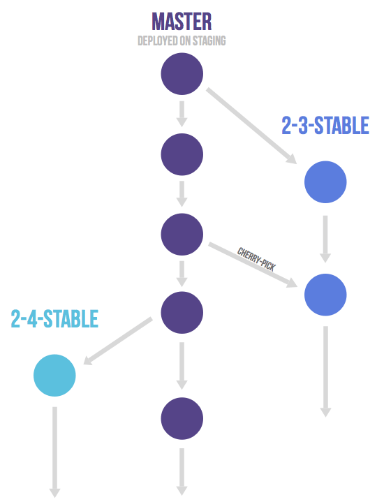

# 环境划分

### 开发环境
主要用于开发及调试，这个环境中的代码变化最为频繁。
存在形式：开发人员自己使用的PC上，只有开发人员自己修改调试。

### 测试环境
主要用于测试，这个环境中代码相对稳定。测试和开发会出现并行的情况，因此未正常运行的代码通常不允许进入到这个环境中，以免影响测试。
存在形式：公司内网的测试服务器或容器上部署，自动化运维系统进行持续构建。

### 生产环境
用于线上对外提供服务，是真实用户的环境。测试及产品人员会在功能及修改上线后，验证及确认。
存在形式：外网云主机或集群上部署，自动化运维系统进行持续构建。

# Git工作流

Gitlab flow是Git flow与Github flow的综合。它吸取了两者的优点，既有适应不同开发环境的弹性，又有单一主分支的简单和便利。
Gitlab flow的最大原则叫做"**上游优先**"（upsteam first），即只存在一个主分支master，它是所有其他分支的"上游"。只有上游分支采纳的代码变化，才能应用到其他分支。
Gitlab flow分成**持续发布**和**版本发布**两种情况，适应不同的开发流程。

### 持续发布
适用于持续更新维护的综合项目。如合伙人开放接口项目，合伙人管理后台的前端项目，合伙人客户前台的前端项目。
在master分支以外，再建立不同的环境分支。比如，"开发环境"的分支是master，"测试环境"的分支是test，"生产环境"的分支是production。
开发分支是预发分支的"上游"，预发分支又是生产分支的"上游"。代码的变化，必须由"上游"向"下游"发展。比如，生产环境出现了bug，这时就要新建一个功能分支，先把它合并到master，确认没有问题，再cherry-pick到test，这一步也没有问题，才进入production。


### 版本发布
适用于相对稳定的支撑型项目或组件库。如统一认证平台，短信服务平台，文件管理平台，统一认证SDK。
每发布稳定版本，都要从master分支拉出一个分支。以后，只有修补bug，才允许将代码合并到这些分支，并且要更新小版本号。


### 分支使用
- 主分支master、环境分支、版本分支是保护分支，只能进行合并请求，不能直接提交代码。
- 功能需求或bug修复，从master拉出新feature分支，命名为**feature/{开发人员姓名首字母缩写}-{YYMMDD}**。在发布完成后，删除分支。

# Git规范

### 原则
- 提交说明必须按照Commit规范严格执行。
- 合理控制提交内容的粒度，一次commit只包含一个独立功能点。禁止一次提交涵盖多个功能项。

### Commit规范
commit message包括三个部分：header，body(可省略)和footer(可省略)。
```
<header>
<BLANK LINE>
<body>
<BLANK LINE>
<footer>
```

##### header
header部分只有一行，包括三个字段：type(必需)、scope(可选)和subject(必需)。
```
<type>(<scope>):<subject>
```
- type
type 用于说明 commit 的类别，必须为以下类型的一种：
**feat**: 新功能
**fix**: bug修正
**docs**: 文档变更
**style**: 格式更改 (例如空格、格式化、少了分号)
**refactor**: 重构(不是bug修正，也不是添加新功能，一般是优化调整)
**test**: 添加或修正测试
**chore**: 对构建或者辅助工具的更改(例如生成文档)
- scope
scope 用于说明 commit 影响的范围。
- subject
subject 用于对 commit 变化的简洁描述，不超过50个字符。
##### body
body部分是对本次 commit 的详细描述，可以分成多行。
##### footer
footer部分用于两种情况：不兼容的变动、关闭 issue
##### 正例
```
feat: 添加订单详情接口
fix: 订单缺少关联商品
refactor: 订单统计优化
```
##### 反例
```
update
修改BUG
更新:订单明细导出
20201011-fix order sum
```

# 最佳实践

Git工作流中对分支的使用，除了操作上自觉遵循规范，还必须有项目中对Git钩子的运用，通常会配合源码规范检查。

### 提交工作流钩子
- 源码规范检查
- 遵循Commit规范
- 遵循分支命名规范

### PHP项目推荐组件
- squizlabs/php_codesniffer
- captainhook/captainhook
- ramsey/conventional-commits 1.1

### React项目推荐组件
- @umijs/fabric
- git-branch-is

# 附录

- 语义化版本 2.0.0
https://semver.org/lang/zh-CN/spec/v2.0.0.html
